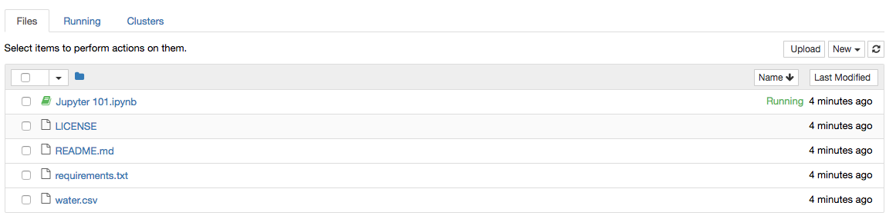
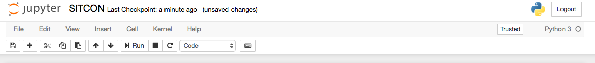
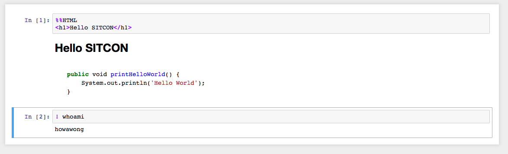
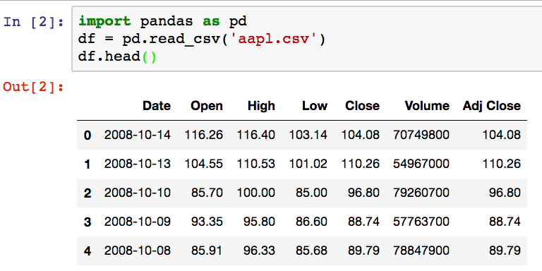
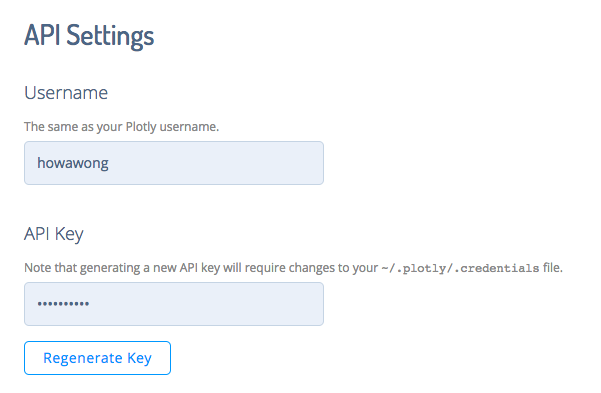

:title: Jupyter 101
:author: Ho Wa Wong
:description: Jupyter 101 at SITCON X HK 2017
:keywords: jupyter, data, python, plotly
:css: styles.css
:id: index

Jupyter 101 @ SITCON X HK 2017
==============================

.. raw:: html

  

  Wong Ho Wa 
  howa.wong@gmail.com 
  2 Oct, 2017 
  

----

Today's Agenda
==============

1. Jupyter
2. Pandas
3. Plot.ly
4. scikit

----

:id: me

About Myself
============

* Python & Open Source Developer
* Open Data Advocate
* Now working at Oursky Ltd

----

What is Jupyter?
================

.. image:: images/jupyter-sq-text.svg
   :width: 500
   :height: 500

----

.. _kernels: https://github.com/jupyter/jupyter/wiki/jupyter-kernels

Jupyter is ...
==============

* forked from ipython in 2014
* interactive data science tool
* language agnostic (kernels_)
* rich support and free

----

.. role:: bash(code)
   :language: bash

Installation
============

* Very simple
* :bash:`python3 -mvenv ./env`
* :bash:`pip install jupyter`

----

Let's Run Jupyter 
=================
* :bash:`jupyter notebook`

----

Interface
=========

* Home
* Cell
* Toolbar
* Counter

----

Interface (Home)
================

----

Interface (Tool Bar)
====================

----

Interface (Cells & Counter)
===========================

----

Markdown
================

* Simple, just like README.md in github
* Can also include LaTex
* General HTML

----

:data-rotate: 90

Markdown (Cont.)
================

Now, let's write some code. :)
------------------------------

----

lsmagic
=======
* Show you magic functions
* :bash:`%env SITCON=2017`
* :bash:`%%writefile hello.py`, :bash:`%pycat hello.py`

----

Code
====

* :bash:`! ls`
* Now let's write some python code!

----

Data Manipulation with Pandas
=============================

.. image:: http://pandas.pydata.org/_static/pandas_logo.png

* Open source data analysis library

----

Pandas
======
* Basic Concepts
	* Series
		* 1D array
	* DataFrame
		* 2D array
	* Properties
		* indices
		* columns

----

Let's load some data first
==========================
* :bash:`df.read_csv`
* :bash:`df.head`

----

Query
=====

----

Column Mainuplation
===================

----

Aggregation
===========

----

Sorting
=======

----

Visualization
=============

* So far we just display the data in tabular
* Let's do some graph plotting

----

Popular Plotting Library
========================
* Matlibplot
* Plot.ly
* etc
* Today we use plot.ly

----

Plot.ly
==========

* Registration 
* You need `username` and `API Key`

----

Plot.ly
=======
* Let's try a bar chart first
* And then a pie chart

----

Plot.ly
=======
* What about a map?

----

Machine Learning
================
* scikit
* Simple Linear Regression

----

:data-rotate: 270
:id: thank-you

