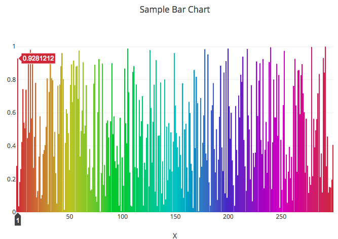
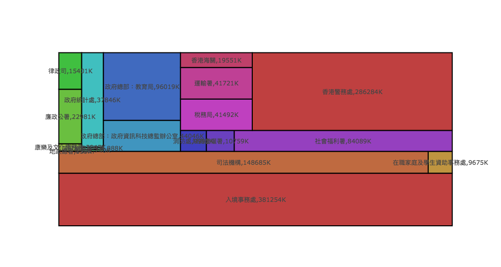
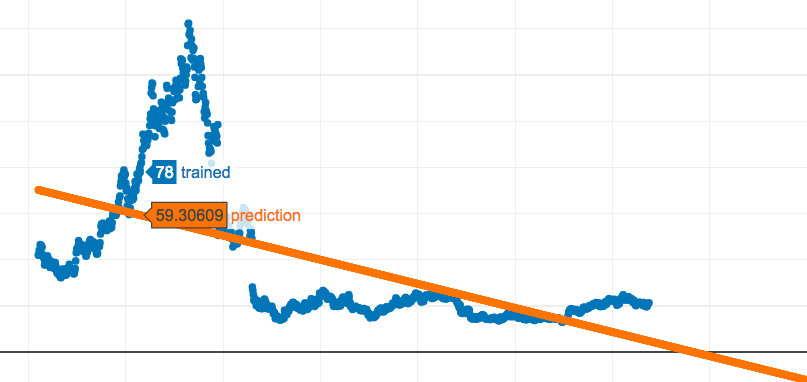

:title: Jupyter 101
:author: Ho Wa Wong
:description: Jupyter 101 at SITCON X HK 2017
:keywords: jupyter, data, python, plotly
:css: styles.css
:id: index

Jupyter 101 @ SITCON X HK 2017
==============================

.. raw:: html

  

  Wong Ho Wa 
  howa.wong@gmail.com 
  2 Oct, 2017 
  

----

Today's Agenda
==============

1. *Notebook*: Jupyter
2. *Data Processing*: Pandas
3. *Data Visualization*: Plotly
4. *Machine Learning*: sklearn & Propert

----

:id: me

About Myself
============

.. _g0vhk: http://g0vhk.io
.. _oursky: http://oursky.com

* Python & Open Source Developer
* Open Data Advocate
* Now working at Oursky_ Ltd
* Founder of g0vhk_

.. image:: images/me.jpg

----

What is Jupyter?
================

----

.. _kernels: https://github.com/jupyter/jupyter/wiki/jupyter-kernels

Jupyter is ...
==============

* forked from ipython in 2014
* interactive data science & programming tool
* language agnostic (kernels_)
* rich support and free

----

:data-scale: 2

How does that work
==================

.. image:: images/jupyter.png

----

:data-scale: 1

.. role:: bash(code)
   :language: bash

Installation
============

.. raw:: html

  <pre>
    <code class="bash">
       python3 -mvenv ./env
       source ./env/bin/activate
       pip install -r requirements.txt
     </code>
  </pre>

----

:data-y: 500

Let's Run Jupyter 
=================
* :bash:`jupyter notebook`
* go to http://localhost:8888

----

:id: interface

Interface
=========

* Home
* Cell
* Toolbar
* Counter

.. image:: images/sample_ui.png

----

:data-y: 900

Markdown
================

* Simple, just like README.md in github
* Can also include LaTex
* General HTML

----

:data-rotate: 90

Markdown (Cont.)
================

Now, let's write some code. :)
------------------------------

----

Data Manipulation with Pandas
=============================

.. image:: http://pandas.pydata.org/_static/pandas_logo.png

* Open source data analysis library

----

:id: pandas-concept

Pandas
======
* Basic Concepts
    * Series
        * 1D array
    * DataFrame
        * 2D array
    * Properties
        * indices
        * columns

.. image:: images/sample_df.png

----

Let's load some data first
==========================

.. raw:: html

  <pre>
    <code class="python">
    import pandas as pd
    df = pd.read_csv('aapl.csv')
    df.head()
    df[0].count #Number of Rows
      </code>
  </pre>

----

Selecting Row by Conditions
===========================

.. raw:: html

  <pre>
    <code class="python">
    df2 = df[(df['Date'] >= '1999-01-01') 
             & (df['Date'] <= '1999-02-28')]
    df2.head()
      </code>
  </pre>

----

Column Manipulation
===================

.. raw:: html

  <pre>
    <code class="python">
    del df['Adj Close'] 
    df['year'] = pd.to_numeric(df['Date'].str[0:4])
      </code>
  </pre>

----

Aggregation
===========

.. raw:: html

  <pre>
    <code class="python">
    df2 = df.groupby('year').agg(['mean'])
    </code>
  </pre>

----

Sorting
=======

.. raw:: html

  <pre>
    <code class="python">
    df = df.sort_values('Date')
    df = df.reset_index(drop = True)
      </code>
  </pre>

----

Visualization
=============

* Getting bored? 
* So far we just display the tabular data
* Let's do some graph plotting

----

Popular Plotting Library
========================
* Matplotlib
* Plot.ly
* ggplot
* Today we use plot.ly

----

:id: plotly-reg

Plot.ly
==========

* Registration
* Setting Page
* You need `username` and `API Key`

.. image:: images/api_key.png

----

Using Plot.ly
=============

.. raw:: html

    <pre>
        <code class="python">
        import plotly 
        plotly.tools.set_credentials_file(username='<USERNAME>',
                                          api_key='<API-KEY>')

        import plotly.plotly as py
        import plotly.graph_objs as go
        </code>
    </pre>   

----

:id: scatter-1

Plot.ly (Scatter)
=================

.. image:: images/scatter.png

----

Plot.ly (Scatter)
=================
* Let's try a scatter chart first

.. raw:: html

    <pre>
        <code class="python">
        c= ['hsl('+str(h)+',50%'+',50%)'
            for h in np.linspace(0, 360, N)]
        trace = go.Scatter(x=X,
                           y=Y,
                           mode='markers',
                           name='random',
                           marker={'color': c})
        py.iplot([trace]) 
        </code>
    </pre> 

----

:id: bar

Plot.ly (Bar)
=================

----

Plot.ly (Bar)
=================

.. raw:: html

    <pre>
        <code class="python">
        bars = go.Bar(x=X, y=Y)
        py.iplot([bars])
        </code>
    </pre> 

----

:id: treemap

Plot.ly (Tree Map)
========================

----

Plot.ly (Tree Map)
==================

.. raw:: html

    <pre>
        <code class="python">
        import squarify
        normed = squarify.normalize_sizes(values, width, height)
        rects = squarify.squarify(normed, x, y, width, height)    
        </code>
    </pre> 

----

Machine Learning
================
* Program which **"learns"** from data, without being modified.
* Today, we will take stock prediction as an example.

----

:id: linear

Simple Linear Regression
========================

----

Simple Linear Regression
========================
* sklearn
* Simple Linear Regression
    * Minimize mean square error

----

Simple Linear Regression
========================

.. raw:: html

    <pre>
        <code class="python">
        from sklearn import linear_model
        X = [[x] for x in trained_data['index']]
        y = trained_data['Open'].tolist()
        reg = linear_model.LinearRegression()
        reg.fit(X, y)
        ...
        reg.predict(X2)
        </code>
    </pre> 

----

Want to get a better result?
============================
Let's try Facebook's prophet!
=============================

* Forecasting is a hard problem
* Prophets provides a easy to use API
* Addictive Model
* with Seasonality and Public Holidays

----

Prophet
=======

.. raw:: html

    <pre>
        <code class="python">
        from fbprophet import Prophet
        m = Prophet()
        ...
        m.fit(trained_data_2)
        future = m.make_future_dataframe(periods=365*3)
        forecast = m.predict(future)
        forecast[['ds', 'yhat']].tail()
        </code>
    </pre>

----

:id: prophet

Prophet Result
==============

----

:data-rotate: 270

Thank You! Happy Coding!
========================

